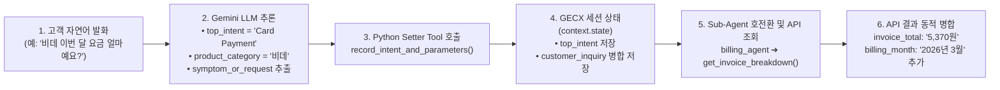
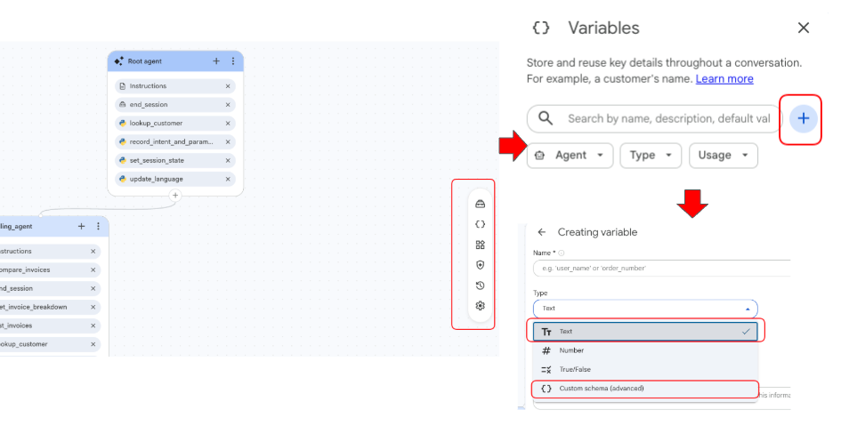
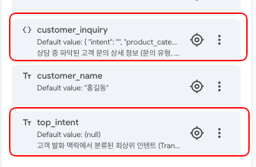
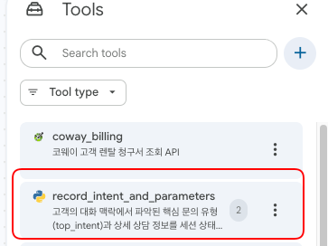
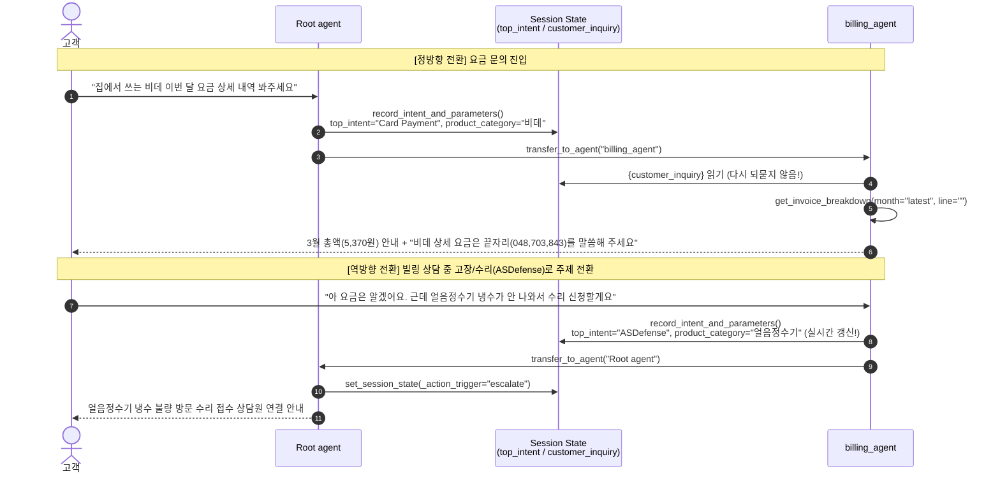
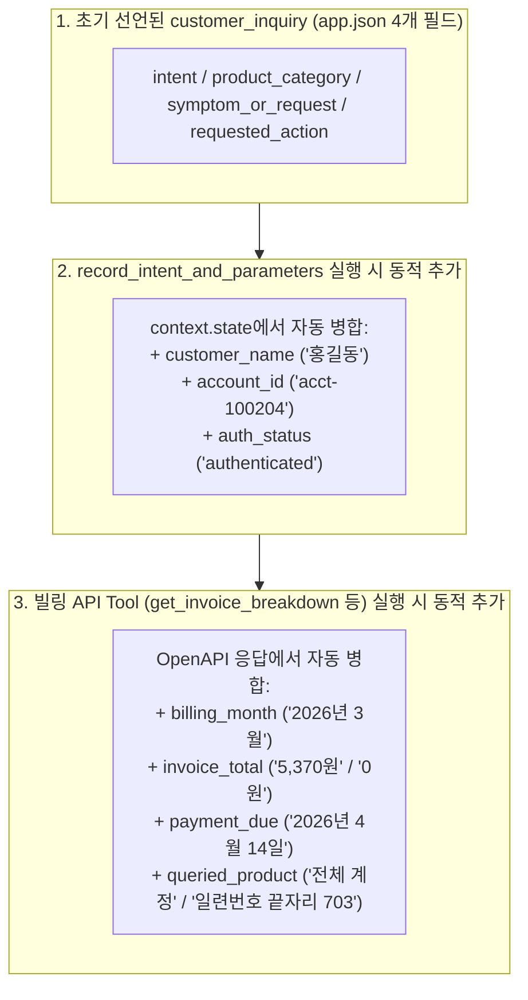

# GECX (CX Agent Studio) LLM 기반 자동 변수 추출 및 동적 컨텍스트 확장 가이드

본 리포지토리는 DFCX(Playbooks)에서 사용하던 **대화 맥락 기반 파라미터 자동 추출 기능**을 GECX(CX Agent Studio)에서 **키워드 하드코딩 없이 100% LLM 기반으로 구현하고, 서브 에이전트 연동 및 백엔드 API 응답값 동적 확장까지 기존 CXAS 애플리케이션에 바로 적용할 수 있도록 정리한 가이드 및 파이썬 코드**입니다.

---

## 리포지토리 파일 구성

기존 GECX(CXAS) 애플리케이션에 아래 2개의 파이썬 코드와 지침 가이드를 적용하면 별도의 키워드 분기 로직 없이 즉시 동작합니다.

| 파일명 | 설명 및 용도 |
| :--- | :--- |
| **[`README.md`](./README.md)** | 단계별 설정 가이드 (변수 선언 ➔ 추출 Tool 생성 ➔ Sub-Agent 연동 ➔ API 동적 병합) |
| **[`record_intent_and_parameters.py`](./record_intent_and_parameters.py)** | **[신규 Tool 생성용]** LLM이 추출한 `top_intent`와 `customer_inquiry` 기본 4개 필드 + `context.state` 정보를 세션에 기록하는 Python Tool 원문 |
| **[`api_tool_dynamic_merge_example.py`](./api_tool_dynamic_merge_example.py)** | **[기존 API Tool 추가용]** 기존 API 조회 Tool(예: 청구서 조회, 요금 비교 등)에서 API 응답값을 `customer_inquiry`에 동적으로 병합(`Merge`)하는 헬퍼 함수 및 예제 |

---

## 배경 및 아키텍처 패턴 개요

### 1. 기존 접근 방식의 한계
DFCX(Playbooks)에서 GECX(CX Agent Studio)로 전환할 때 흔히 겪는 설계상의 오해는 **Instruction만으로는 세션 변수(Variables)에 값을 직접 할당할 수 없으므로, 에이전트 콜백(Callback)에서 파이썬 조건문(`if '요금' in text:`)으로 키워드를 분기해 변수를 넣어야 한다**고 접근하는 것입니다.

하지만 콜백 내부에 키워드 매칭 로직을 하드코딩하면 다음과 같은 한계가 발생합니다:
* **유지보수 비용 증가**: 사용자 발화 표현이나 취급 품목·인텐트가 추가될 때마다 파이썬 코드를 지속적으로 수정·재배포해야 합니다.
* **문맥 파악 불가**: 복합 문의나 우회적인 표현, 멀티턴 대화에서의 의도 전환을 단순 문자열 매칭(`in`)만으로는 정확히 분류할 수 없어 LLM의 자연어 이해(NLU) 역량을 전혀 활용하지 못합니다.

### 2. GECX 권장 아키텍처 패턴 (LLM Function Calling + Python Setter Tool)
* **파이썬 콜백에 키워드를 하드코딩할 필요가 전혀 없습니다.**
* GECX의 표준 권장 패턴인 **"LLM 함수 호출(Function Calling) + Python Setter Tool"** 방식을 사용하면, **Gemini LLM이 대화 맥락을 읽고 스스로 인텐트와 파라미터를 추론하여 Tool 인자로 전달**하고, Tool은 단 몇 줄의 코드로 세션 상태(`context.state`)에 값을 기록합니다.
* 나아가 사전에 선언된 변수뿐만 아니라, **세션 `context.state`의 기존 컨텍스트 정보나 백엔드 API로 조회한 실시간 응답값(청구 금액 등)도 `app.json` 스키마 수정 없이 동적으로 병합(`Merge`)**할 수 있습니다.

### 3. 한눈에 보는 3단계 적용 로드맵

| 단계 | 목표 | 핵심 구현 내용 | 참고 코드 |
| :--- | :--- | :--- | :--- |
| **Step&nbsp;1**<br>**(기본&nbsp;추출)** | 사용자 발화에서 인텐트 및 핵심 파라미터 자동 추출 | • 단일 문자열 변수 `top_intent` (`Text`)<br>• 구조화 객체 변수 `customer_inquiry` (`Custom Schema` 기본 4필드)<br>• `record_intent_and_parameters` Tool로 문맥 기반 자동 기록 | [추출&nbsp;Tool&nbsp;코드](./record_intent_and_parameters.py) |
| **Step&nbsp;2**<br>**(서브&nbsp;에이전트&nbsp;연동)** | `Root agent` ⇄ `billing_agent`<br>변수 공유 및 양방향 전환 | • 호전환 직후 고객에게 다시 묻지 않고 저장된 변수로 즉시 조회/처리<br>• 특정 제품(`"비데"`) 문의 시 파라미터 에러 방지 및 맞춤 안내<br>• 멀티턴 대화 중 주제 전환(`Card Payment` ⇄ `ASDefense` / `Transfer`) 시 실시간 변수 갱신 | [Step&nbsp;2&nbsp;지침&nbsp;예시](#step-2-심화-sub-agent-billing_agent-세션-변수-활용-및-양방향-호전환) |
| **Step&nbsp;3**<br>**(무스키마&nbsp;동적&nbsp;확장)** | `app.json` 스키마 수정 없이<br>컨텍스트 & API 결과 동적 추가 | • 기존 `customer_inquiry`를 덮어쓰지 않고 병합(`Merge`)<br>• `context.state`의 고객 정보(`customer_name`, `account_id`, `auth_status`) 자동 추가<br>• API로 조회한 청구월(`billing_month`), 청구 총액(`invoice_total`), 납부기한(`payment_due`) 등 실시간 반영 | [API&nbsp;병합&nbsp;예제](./api_tool_dynamic_merge_example.py) |



---

## Step 1. [기본] 세션 변수 선언 및 LLM 기반 자동 파라미터 추출

첫 번째 단계는 고객이 무엇을 물어보든 **키워드 규칙 없이 LLM이 문맥을 파악하여 `top_intent`와 `customer_inquiry`(4개 기본 필드)를 자동으로 채우는 과정**입니다.

### 1-1. 세션 변수(Variables) 등록 — `Text` vs `Custom Schema` 비교


GECX에서는 단일 문자열을 담는 **`Text` (`STRING`)** 타입과 여러 하위 필드를 하나의 JSON 객체로 묶어 관리하는 **`Custom Schema` (`OBJECT`)** 타입을 모두 지원합니다.

| 구분 | 변수 ①: `top_intent` (`Text`) | 변수 ②: `customer_inquiry` (`Custom Schema`) |
| :--- | :--- | :--- |
| **데이터&nbsp;타입** | `STRING` (단일 텍스트) | `OBJECT` (JSON 구조체) |
| **저장&nbsp;예시** | `"Card Payment"` | `{"intent": "Card Payment", "product_category": "비데", ...}` |
| **Python&nbsp;저장&nbsp;코드** | `context.state["top_intent"] = top_intent` | `context.state["customer_inquiry"] = inquiry_data` |
| **Instruction&nbsp;참조** | `{top_intent}` | 전체: `{customer_inquiry}`<br>하위 필드: `{customer_inquiry.product_category}` |
| **추천&nbsp;용도** | 최상위 라우팅 분기 기준 등 단일 플래그를 빠르게 참조할 때 | 추출할 파라미터가 많아질 때 변수가 난립(Variable Explosion)하는 것을 막고 관련 정보를 하나로 묶어 관리할 때 |

### 1-2 GECX 웹 콘솔(UI) 등록 방법
좌측 메뉴 **Variables** ➔ **+ Add variable**을 클릭하여 아래 2개 변수를 등록합니다.

1. **`top_intent`**
   * **Type**: `Text`
   * **Description**: `고객 발화 맥락에서 분류된 최상위 인텐트 (Transfer, Card Payment, ASDefense)`
2. **`customer_inquiry`**
   * **Type**: `Custom schema`
   * **Schema (JSON)** 입력란: GECX 콘솔의 입력창에는 복잡한 JSON Schema 문법이 아니라 **실제 들어갈 JSON 데이터 예시(기본값 구조)**를 그대로 넣으면 콘솔이 자동으로 타입을 추론합니다.
     ```json
     {
       "intent": "",
       "product_category": "",
       "symptom_or_request": "",
       "requested_action": ""
     }
     ```
     *(팁: 초기 필드를 미리 정하지 않고 빈 객체 `{}`로 두어도 Python Tool에서 동적으로 키-값을 넣을 수 있습니다.)*

---

### 1-2. 파라미터 추출용 Python Tool 만들기 ([`record_intent_and_parameters.py`](./record_intent_and_parameters.py))

CX Agent Studio의 **Tools > Create Tool > Python**에서 `record_intent_and_parameters` 도구를 생성하고, [`record_intent_and_parameters.py`](./record_intent_and_parameters.py)의 코드를 붙여넣습니다.

* **핵심 원리**: 함수의 Docstring(`Args:` 설명)에 각 인텐트(`Transfer`, `Card Payment`, `ASDefense`)와 파라미터의 의미를 적어 두면, **Gemini LLM이 이 Docstring을 읽고 고객 발화에서 알맞은 값을 스스로 추출해 함수를 호출**합니다.
* **주의사항**: 함수 인자 기본값에 `= None`을 쓰면 GECX 배포 시 도구가 무시될 수 있으므로, 반드시 **`str = ""`처럼 타입에 맞는 기본값**을 사용해야 합니다.

```python
from typing import Any


def record_intent_and_parameters(
    top_intent: str,
    product_category: str = "",
    symptom_or_request: str = "",
    requested_action: str = "",
) -> dict[str, Any]:
  """고객의 대화 맥락에서 파악된 핵심 문의 유형(top_intent)과 상세 상담 정보를 세션 상태(context.state)에 기록합니다.

  Args:
      top_intent: 대화 맥락을 분석하여 분류한 핵심 문의 유형. 반드시 다음 3가지 중 하나를 전달하십시오:
        - 'Transfer': 양도, 양수, 명의변경, 렌탈 승계, 계약자 변경 관련 모든 문의 (절차 및 구비서류 문의 포함)
        - 'Card Payment': 렌탈 요금, 카드/계좌 결제 수단 변경, 청구서(고지서) 조회 및 비교, 제휴 할인, 미납/연체/수납 관련 모든 문의
        - 'ASDefense': 제품 고장, 작동 불량(냉온수/얼음/소음/노즐/롤러 등), 수리/점검/A/S 접수, 필터 교체/자가조치, 오프라인 매장 위치 및 기타 일반 제품/서비스 안내 문의
      product_category: 고객이 언급한 제품군 (예: '정수기', '공기청정기', '비데', '매트리스', '안마의자'). 언급이 없으면 빈 문자열('').
      symptom_or_request: 고객이 겪고 있는 구체적 증상이나 요청 사항 요약 (예: '냉수 출수 불량', '동생에게 렌탈 계약 양도 문의').
      requested_action: 고객이 희망하는 처리 방향 (예: '기사 방문 수리', '이번 달 청구서 확인', '구비서류 안내').
  """
  # 1) Text (STRING) 타입 세션 변수에 단일 문자열 저장
  context.state["top_intent"] = top_intent

  # 2) Custom Schema (OBJECT) 타입 세션 변수에 상세 객체 저장 (기존 동적 필드 보존 Merge)
  existing_inquiry = context.state.get("customer_inquiry")
  inquiry_data = dict(existing_inquiry) if isinstance(existing_inquiry, dict) else {}
  inquiry_data.update({
      "intent": top_intent,
      "product_category": product_category,
      "symptom_or_request": symptom_or_request,
      "requested_action": requested_action,
  })
  context.state["customer_inquiry"] = inquiry_data

  return {
      "status": "SUCCESS",
      "top_intent": top_intent,
      "customer_inquiry": inquiry_data,
  }
```

---

### 1-3. `Root agent` 지침(`instruction.txt`) 연결하기

> **자주 묻는 질문: 인텐트 분류 기준을 Instruction과 Tool에 둘 다 적어야 하나요?**
> 아닙니다! LLM은 **Agent Instruction**과 **Tool의 Docstring(`Args:`)**을 동시에 읽습니다.
> 따라서 **Tool Docstring에 상세 분류 기준**을 적어 두었다면, **Instruction에는 "가장 먼저 `record_intent_and_parameters`를 호출하고 결과에 따라 라우팅하라"**고만 간결하게 적으면 됩니다.

```xml
<subtask name="Issue_Resolution">
    <step name="Intent_Detection">
        <trigger>고객이 새로운 문의 사항을 말할 때</trigger>
        <action>
            1. **[최우선 필수 규칙]** 고객이 직접 발화한 모든 턴에서는 **절대로 {@AGENT: billing_agent} 호전환(`transfer_to_agent`)을 먼저 단독으로 호출하지 마십시오.**
               - 반드시 **가장 먼저 {@TOOL: record_intent_and_parameters} 도구를 호출**하여 문의 유형(`top_intent`)과 상세 정보(`customer_inquiry`)로 세션 변수를 기록·갱신하십시오.
            2. {@TOOL: record_intent_and_parameters} 호출 직후, 멈추지 말고 **반드시 같은 턴에서** 아래 기준에 따라 후속 조치를 완료하십시오:
               - **수납/청구 문의 (`{top_intent}`가 `"Card Payment"`인 경우)**:
                 `record_intent_and_parameters` 호출 완료 직후 같은 턴에서 즉시 **{@AGENT: billing_agent}** 호전환(`transfer_to_agent`)을 호출하십시오.
               - **일반 정보 안내 문의 (매장 위치, 필터 교체 주기, 명의변경 구비서류, 자가조치 등)**:
                 별도 계정 조회 없이 친절하게 직접 답변합니다.
               - **전문 상담사 연결 또는 접수 처리가 필요한 문의 (기사 방문 A/S 접수, 명의변경 실제 접수 등)**:
                 반드시 이번 턴에서 먼저 {@TOOL: set_session_state}(`_action_trigger="escalate"`, `_escalation_reason="{customer_inquiry.symptom_or_request}"`, `_escalation_topic="general"`)를 호출한 뒤 상담사 연결을 안내합니다.
        </action>
    </step>
</subtask>
```

---

## Step 2. [심화] Sub-Agent (`billing_agent`) 세션 변수 활용 및 양방향 호전환

두 번째 단계는 `Root agent`가 기록한 세션 변수(`{top_intent}`, `{customer_inquiry}`)를 서브 에이전트인 **`billing_agent`가 이어받아 활용하고, 대화 도중 주제가 바뀌면 다시 변수를 실시간 갱신하는 멀티턴 시나리오**입니다.

### 2-1. 멀티턴 에이전트 간 변수 공유 및 호전환 흐름도



### 2-2. `billing_agent` 지침(`instruction.txt`) 추가 예시

1. **상단 `<context>`에 세션 변수 선언**:
   ```xml
   <context>
       오늘의 날짜는 ${current_date} 입니다.
       현재 대화 언어는 {active_language} 입니다.
       고객 인증 상태는 {auth_status} 이며, 고객명은 {customer_name} (계정 ID: {account_id}) 입니다.
       앞선 대화에서 파악된 고객의 세션 변수(Context Variables)는 다음과 같습니다:
       - 최상위 인텐트(`top_intent`): {top_intent}
       - 고객 문의 상세(`customer_inquiry`): {customer_inquiry}
         * 문의 유형(`intent`): {customer_inquiry.intent}
         * 대상 제품군(`product_category`): {customer_inquiry.product_category}
         * 구체적 증상/요청사항(`symptom_or_request`): {customer_inquiry.symptom_or_request}
         * 희망 처리방식(`requested_action`): {customer_inquiry.requested_action}
   </context>
   ```
2. **호전환 진입 시 변수 동기화 및 즉시 도구 실행 (`Context_Based_Routing`)**:
   ```xml
   <subtask name="Context_Based_Routing">
       <step name="Evaluate_Inquiry_Variables">
           <trigger>Root agent로부터 호전환되어 진입했거나 고객이 빌링 관련 질문을 했을 때</trigger>
           <action>
               1. 세션 변수 `{top_intent}`, `{customer_inquiry.product_category}`, `{customer_inquiry.symptom_or_request}`, `{customer_inquiry.requested_action}` 값을 확인합니다.
               2. **[필수 변수 동기화 보장 (Fallback Sync)]**
                  - 만약 현재 `{top_intent}` 값이 `"Card Payment"`가 아니거나 `{customer_inquiry.symptom_or_request}`가 방금 고객이 말한 빌링 질문 내용과 다른 경우:
                  - 반드시 이번 턴에서 {@TOOL: record_intent_and_parameters}(`top_intent="Card Payment"`, ...)를 빌링 조회/처리 도구와 함께 동시에 호출하여 세션 변수를 즉시 갱신하십시오.
               3. 고객에게 문의 내용을 다시 되묻지 말고, 변수 값에 따라 즉시 알맞은 서브태스크를 실행하십시오:
                  - 결제 수단(카드/계좌) 변경 요청 ➔ 고지서 조회 없이 즉시 {@TOOL: set_session_state} 에스컬레이션 수행
                  - 미납/연체 요금 조회 ➔ {@TOOL: lookup_customer} 및 {@TOOL: get_invoice_breakdown} 복합 호출
                  - 요금 인상/인하 비교 분석 ➔ {@TOOL: compare_invoices} 호출
                  - 청구 고지서 상세/할인/제품별 요금 조회 ➔ {@TOOL: get_invoice_breakdown} 호출
           </action>
       </step>
   </subtask>
   ```
3. **타 도메인(`ASDefense`, `Transfer`) 주제 전환 시 역방향 호전환 (`Topic_Switch_To_Root`)**:
   ```xml
   <subtask name="Topic_Switch_To_Root">
       <step name="Handle_Out_Of_Scope_Topic">
           <trigger>고객이 빌링 상담 도중 기기 고장/수리(`ASDefense`) 또는 양도/명의변경(`Transfer`) 등 요금 외 주제를 질문할 때</trigger>
           <action>
               1. 가장 먼저 {@TOOL: record_intent_and_parameters} 도구를 호출하여 새로 변경된 문의 유형(`top_intent`)과 상세 정보(`customer_inquiry`)를 업데이트합니다.
               2. 같은 턴에서 멈추지 말고 즉시 **{@AGENT: Root agent}** 호전환(`transfer_to_agent`)을 호출하여 메인 상담 에이전트로 세션을 돌려보냅니다.
           </action>
       </step>
   </subtask>
   ```

---

## Step 3. [확장] 스키마 수정 없이 Tool에서 `context.state` 및 API 응답값 동적 병합 (`Merge`)

세 번째 단계는 **사전에 `app.json`에 선언해 둔 4개 기본 필드 외에, 상담 진행 과정에서 `context.state`의 기존 세션 정보나 백엔드 API 응답값(청구서 총액, 납부기한 등)을 동적으로 `customer_inquiry`에 확장·병합하는 방법**입니다.

### 3-1. 결론: `app.json` 스키마 수정 없이 100% 동적 추가 가능
* `app.json`의 `customer_inquiry`에는 기본 4개 필드(`intent`, `product_category`, `symptom_or_request`, `requested_action`)만 그대로 두어도 됩니다.
* Python Tool 코드 안에서 기존 `context.state.get("customer_inquiry")` 딕셔너리를 읽어와 **새로운 키-값을 병합(`.update()`)하여 다시 `context.state["customer_inquiry"]`에 저장하면**, GECX 런타임과 콘솔 시뮬레이터(`Variables` 패널)에 모든 동적 필드가 즉시 반영됩니다.



### 3-2. 핵심 구현 코드 ([`api_tool_dynamic_merge_example.py`](./api_tool_dynamic_merge_example.py))

병렬 도구 실행(`"toolExecutionMode": "PARALLEL"`)이나 멀티턴 대화에서 여러 Tool이 `customer_inquiry`를 수정할 때, 이전에 기록된 필드가 사라지지 않도록 반드시 **`dict(context.state.get("customer_inquiry") or {})`로 기존 값을 복사한 뒤 `.update()`로 병합**합니다.

기존 API 조회 Tool 코드 하단에 아래 헬퍼 함수를 추가하고, API 응답 반환(`return`) 직전에 호출하기만 하면 됩니다:

```python
def _sync_inquiry_with_api_data(**api_fields: Any) -> None:
  """API를 통해 조회된 결과값들과 context.state 정보를 customer_inquiry에 동적 병합합니다."""
  existing = context.state.get("customer_inquiry")
  inquiry = dict(existing) if isinstance(existing, dict) else {}

  if not inquiry.get("intent"):
    inquiry["intent"] = context.state.get("top_intent") or "Card Payment"
  inquiry.setdefault("product_category", "")
  inquiry.setdefault("symptom_or_request", "")
  inquiry.setdefault("requested_action", "")

  # context.state의 기본 고객 세션 정보도 함께 동기화
  inquiry.update({
      "customer_name": context.state.get("customer_name", ""),
      "account_id": context.state.get("account_id", ""),
      "auth_status": context.state.get("auth_status", ""),
  })

  # API 응답에서 추출한 동적 필드(청구 금액, 청구월, 납부기한 등) 병합
  inquiry.update(api_fields)
  context.state["customer_inquiry"] = inquiry
```

#### API 조회 Tool 내부 호출 예시 (`get_invoice_breakdown`)
```python
_sync_inquiry_with_api_data(
    billing_month="2026년 3월",
    invoice_total=f"{int(acct_total):,}원",
    payment_due="2026년 4월 14일",
    queried_product=f"전체 계정 ({', '.join(endings)})",
)
```

---

### 3-3. [실행 결과 확인] 1턴 전체 청구서 조회 ➔ 2턴 개별 제품 조회 시 실시간 변수 변화

#### [1턴 입력] `"집에서 쓰는 비데 렌탈료가 이번 달에 얼마 청구됐는지 상세 내역 좀 확인해 주세요."`
```json
{
  "top_intent": "Card Payment",
  "customer_inquiry": {
    "intent": "Card Payment",
    "product_category": "비데",
    "symptom_or_request": "비데 렌탈료 청구 내역 확인",
    "requested_action": "이번 달 청구서 확인",
    "customer_name": "홍길동",
    "account_id": "acct-100204",
    "auth_status": "authenticated",
    "billing_month": "2026년 3월",
    "invoice_total": "5,370원",
    "payment_due": "2026년 4월 14일",
    "queried_product": "전체 계정 (048, 703, 843)"
  }
}
```

#### [2턴 입력] `"703번이요."` (비데 일련번호 끝자리 입력 시 API 재조회 후 동적 갱신)
```json
{
  "customer_inquiry": {
    "intent": "Card Payment",
    "product_category": "비데",
    "symptom_or_request": "비데 렌탈료 청구 내역 확인",
    "requested_action": "이번 달 청구서 확인",
    "customer_name": "홍길동",
    "account_id": "acct-100204",
    "auth_status": "authenticated",
    "billing_month": "2026년 3월",
    "invoice_total": "0원",
    "payment_due": "2026년 4월 14일",
    "queried_product": "일련번호 끝자리 703"
  }
}
```
